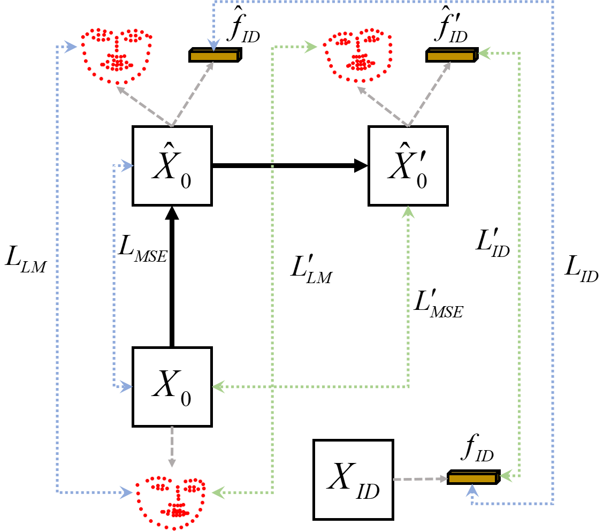

# CFCPalsy: Facial Image Synthesis with Cycle Cross-Fusion Diffusion Model for Facial Paralysis Individuals
This is the official repository for the paper CFCPalsy: Facial Image Synthesis with Cross-Fusion Cycle Diffusion Model for Facial Paralysis Individuals


<div style="background-color: white; padding: 10px; display: inline-block;">
  
</div>

This is an open-source project for facial expression transfer in facial palsy images, aimed at providing high-quality facial palsy expression synthesis methods. We approach the problem from the perspectives of feature extraction, feature fusion, and efficient model training. Based on a diffusion model, we implement multi-condition facial palsy expression image synthesis.


<div style="background-color: white; padding: 10px; display: inline-block;">
  
</div>


### Environment preparation

```
pip install -r requirements.txt
```

### Test CFCPalsy utilizing given sample images
You can quickly experience the facial palsy face synthesis results by first using the model we provide.


- Download the pretrained weights from the [link](https://drive.google.com/drive/folders/1yZz42XhsDvYnNYpS8IAru74TniPHjQD0?usp=drive_link)
- Place the `pretrained_models` directory under `ccfexp` (same level as `src`)
- Run
```
cd ccfexp/src
bash syn.sh
```
# Acknowledgement
This codebase is built based on [DCFace](https://github.com/mk-minchul/dcface). Thank you very much!
